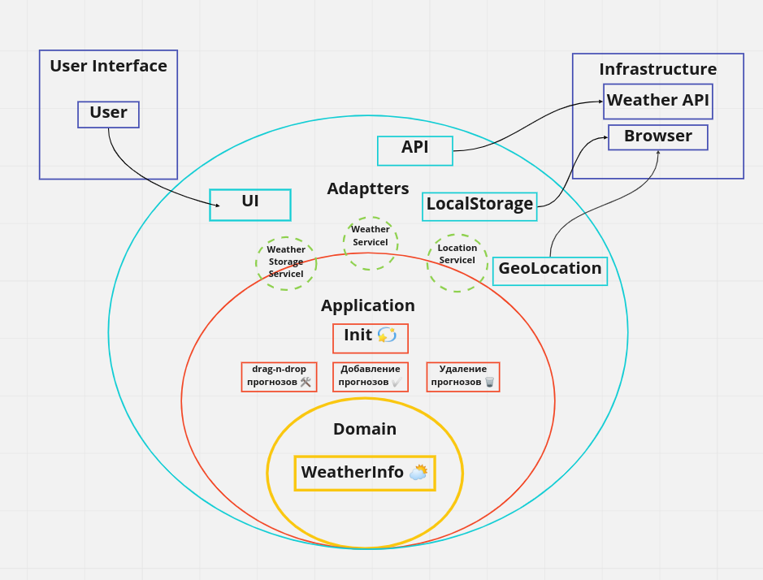

## Пример приложения виджета прогнозов погоды с использованием принципов "Чистой архитектуры"
### Виджет используется путем встраивания кастомного HTML тега `<weather-widget>` на страницу и подключения JS файла
- /example_using - пример использования

<em>Диаграмма архитектуры приложения</em>

### Use cases
- при запуске приложения получение прогноза погоды по текущей геолокации пользователя или показ сохраненных пронозов из локального хранилища
- добавление новых прогнозов используя название города
- удаление прогнозов погоды
- drag-n-drop сортировка списка прогнозов погоды

### Для создания встраиваемого виджета есть некоторые нюансы использования Vue.js
- стили пишутся не в компонентах
- специальный префикс в названиях компонентов
- разные настройки сборки в режиме дев и билда 
